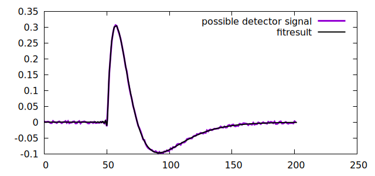

# Digital pulse shape transformation

Electrical signals from pulsed detectors (e.g. particle / gamma-ray detectors) can often be described as step function that went through a series of lowpass and highpass filters.

Consider the following signal


Observations:
  - It is not extremely pointed at the start, so went through a low pass filter.
  - It goes back to the baseline, so it must have gone through a high pass
  - It is bipolar, so it went through a higher order high pass

# Fitting the filter paramters

With the assumtion, that the signal is a step function that was filtered by a first order low pass and a second order high pass filter, the program `fit_func.d` can find the optimal filter paramters under this assuption:

```bash 
./filtool l5 h5 h5  fit:50,1.0 < demo_signal.dat > demo_signal_fitresult.dat 
           5           5           5          50           1  (  0)
     6.00696     5.46083     5.46091     50.1391    0.918295  (  1)     chi=103.907
     7.73087     6.88253     6.88254     50.3905    0.813262  (  2)     chi=84.52
     10.4144     10.6162     10.6161     50.6322    0.836051  (  3)     chi=43.801
     4.68872     17.5175     17.4804     50.0312    0.476238  (  4)     chi=34.0075
     7.59019     14.7418     18.4782     50.1547    0.707077  (  5)     chi=9.5782
     8.04116     13.6565     17.7062     50.3171    0.806944  (  6)     chi=4.21628
#...
     10.0145      10.027     19.8401     50.2919     1.00016  ( 24)     chi=4.03008
     10.0145     10.0271     19.8401     50.2919     1.00016  ( 25)     chi=4.03008


```

The program `filtool` takes an arbitrary number of filters (h,l,H,L) with their parameters:
  - h high pass filter with time constant as parameter
  - l low pass filter with time constant as parameter 
  - H inverse high pass with time constant as parameter
  - L inverse low pass with time constant as parameter
  - i window integral with window width as parameter
  - d delayed difference with delay as parameter

The filter specification is followed by a command (gen, fit, apply):
  - gen generates a step function an applies all specified filters
  - fit fits a function (step function filtered by specified filters) to data points from stdin by varying the filter parameters. Two additional parameters (time shift and amplitude) are also used and the start parameters for these are specified behind the "fit" keyword.
  - apply applies all specified filters to the signal on stdin and outputs the result to stdout



The fit result a good description of the signal. 
The best estimate for the low pass time constant is `10.0145`.
The best estimates for the high pass time constants are `10.0271` and `19.8401`.

Indeed the signal was generated from a step function tha was processed with a low pass filter with time constant `10` and two high pass filterse with time constants `10` and `20` with the following command:

```bash
./filtool l10 h10 h20 gen:-50.3,1.0,150.3,0.004 > demo_signal.dat
```

# Filter inversion

Knowing the filter topology and filter paramters, it is possible to apply matching inverse filters to the signal to reproduce the step function.

This can be done with the command: 

```bash
./filtool L10.0145 H10.0271 H19.8401 apply < demo_signal.dat > step_reconstruction.dat
```


The signal is noisier than the input signal because inverting a low pass filter amplifies noise just as the normal low pass filter reduced noise.
However, the reconstructed step function allows to reshape the pulse shape by applying differnt filters, such as moving average (aka box filter) or delayed differences.

This can be done with the command: 

```bash
./filtool L10.0145 H10.0271 H19.8401 i10 d10 apply < demo_signal.dat > triangle.dat
```


It is possible to create a filter that transforms pulses of a specific shape into triangular shape.
The only condition is that the specific pulse shape must be derived from a step function. 

# Example: Moving average window deconvolution filter (MAWD)

The MAWD filter is a special case in which a single inverse high pass filter, a window integral and a delayed difference are applide to a signal:
Note that the MAWD does not compensate the finite rising edge of the signal.
Instead it uses a wide enough `delayed difference`, and samples the amplitude towards the end of the flat part of the trapezoid where the shape of the rising edge of the pulse has no influence anymore. 


