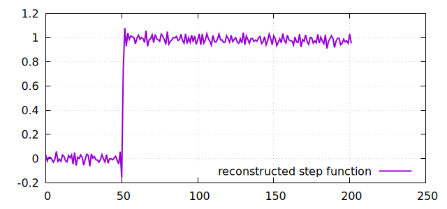

# Digital pulse shape transformation

Electrical signals from pulsed detectors (e.g. particle / gamma-ray detectors) can often be described as step function that went through a series of lowpass and highpass filters.

Consider the following signal


Observations:
  - It is not extremely pointed at the start, so went through a low pass filter.
  - It goes back to the baseline, so it must have gone through a high pass
  - It is bipolar, so it went through a higher order high pass

# Fitting the filter paramters

With the assumtion, that the signal is a step function that was filtered by a first order low pass and a second order high pass filter, the program `fit_func.d` can find the optimal filter paramters under this assuption:

```bash 
./filtool l5 h5 h5  fit:50,1.0 < demo_signal.dat > demo_signal_fitresult.dat 
           5           5           5          50           1  (  0)
     9.55795     6.65426     8.74955     49.7959    0.470427  (  1)     chi=89.6374
     16.8767     16.0206      19.113     50.2495    0.882001  (  2)     chi=51.6394
     14.6862     13.4389     17.0471     49.5556    0.933384  (  3)     chi=28.239
     11.8482     10.7412     15.4924     49.9666     1.08932  (  4)     chi=7.88296
     11.6651     10.3523     16.5656     50.2272     1.11521  (  5)     chi=4.47645
     11.4501     8.97719      19.052     50.2684     1.12759  (  6)     chi=4.45283
     10.7041     9.39507      19.875     50.2797     1.06303  (  7)     chi=3.87555
     10.5547     9.57611     19.8494     50.2794     1.04777  (  8)     chi=3.85333
     10.4523     9.66465     19.8671     50.2792      1.0375  (  9)     chi=3.85293
     10.2472       9.839     19.9086     50.2788      1.0169  ( 10)     chi=3.85281
     10.0456     10.0302     19.9233     50.2787     0.99684  ( 11)     chi=3.85272
     10.1467      9.9371     19.9129     50.2788     1.00696  ( 12)     chi=3.8525
     10.1096     9.97498     19.9115     50.2788     1.00327  ( 13)     chi=3.85247
     10.0344     10.0483     19.9141     50.2788    0.995791  ( 14)     chi=3.85246
     10.0209     10.0631     19.9124     50.2788    0.994454  ( 15)     chi=3.85245
     10.0486      10.035      19.913     50.2788    0.997207  ( 16)     chi=3.85245
     10.0347      10.049      19.913     50.2788    0.995829  ( 17)     chi=3.85245
     10.0345     10.0492     19.9129     50.2788    0.995815  ( 18)     chi=3.85245
     10.0345     10.0492     19.9129     50.2788    0.995814  ( 19)     chi=3.85245

```


The fit result a good description of the signal. 
The best estimate for the low pass time constant is `10.0345`.
The best estimates for the high pass time constants are `10.0492` and `19.9129`.

Indeed the signal was generated from a step function tha was processed with a low pass filter with time constant `10` and two high pass filterse with time constants `10` and `20` with the following command:

```bash
./filtool l10 h10 h20 gen:-50.3,1.0,150.3,0.02 > demo_signal.dat
```

# Filter inversion

Knowing the filter topology and filter paramters, it is possible to apply matching inverse filters to the signal to reproduce the step function.

This can be done with the command: 

```bash
./filtool L10.0345 H10.0492 H19.9129 apply < demo_signal.dat > step_reconstruction.dat
```



The signal is noisier than the input signal because inverting a low pass filter amplifies noise just as the normal low pass filter reduced noise.
However, the reconstructed step function allows to reshape the pulse shape by applying differnt filters, such as moving average (aka box filter) or delayed differences.

This can be done with the command: 

```bash
./filtool L10.0345 H10.0492 H19.9129 i10 d10 apply < demo_signal.dat > triangle.dat
```


It is possible to create a filter that transforms an arbitrary signals shape into triangular shape.
The only condition is that the original signal must be derived from a step function. 

