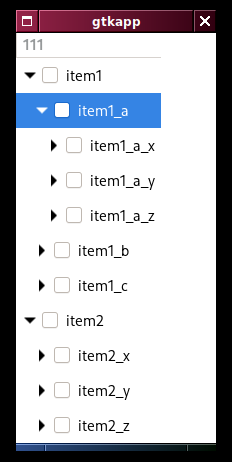

# TreeView in GtkD-4

In gtk-3 there were 
 
 - GtkTreeStore
 - GtkTreeView
 - GtkTreeIter

working together to allow to provide a widget to navigate a hierarchy. 
In gtk-4 these are still present but deprecated.
With gtk-5 these will disappear.
They are supposed to be replaced with 

 - GtkColumnView
 - GtkTreeListModel
 - GtkSignalListItemFactory
 - GtkTreeExpander

I struggled trying to convert my gtk3-code to the gtk4-way of doing this, because it is conceptually completely different and there is no one-to-one correspondence of old and new classes.

Also it was difficult to find a simple, minimal example that only shows how to make a TreeView equivalent.

In the end I found a Vala program that contained what I was looking for ([I think it was this one](https://github.com/elementary/files/tree/gtk4)) and extracted this minimal example using the [D-bindings for gtk4](https://github.com/gtkd-developers/GtkD/tree/gtk4).

Once you know how it works is not so complicated, and I even prefer the new way over the gtk-3 way of doing this.

