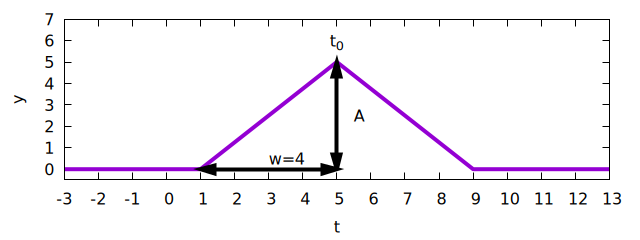
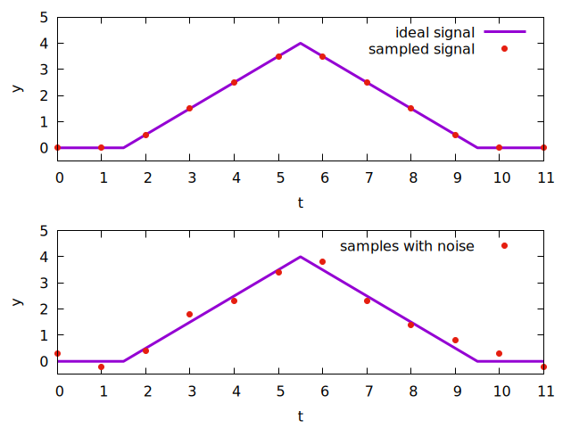
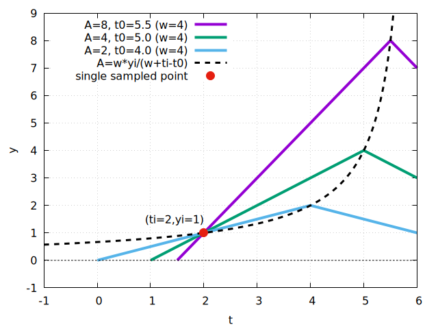
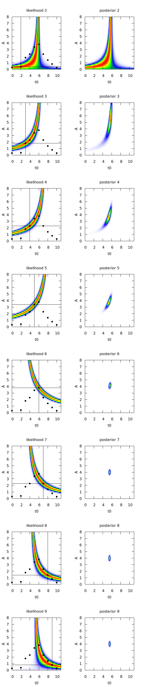
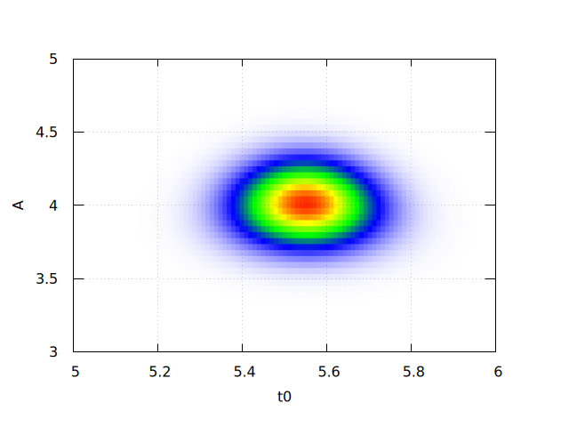
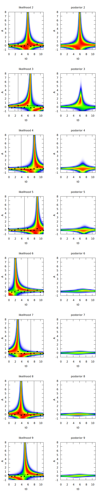
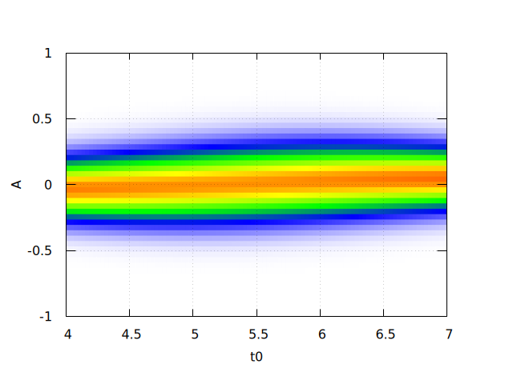

# pulse detection in sampled data

## Motivation

A signal contains noise and pulses of known shape (a triangular shape) but unknown time and amplitude.
What is the best way of filtering out the time and amplitude information from a stream of sampled data points of this signal?

## Pulse shape

The pulse shape is characterized by one parameter `w`, the width of the pulse at half the pulse height.
Both `A` (pulse amplitude) and `t0` (time) of the pulse should be determined.

## Example data

## Likelihood function

If the baseline of the sampled signal is known to be zero and the noise amplitude is `dy`, then the likelihood function for a pulse at `t0` with amplitude `A` can be calculated for each sample `(yi,ti)`:

### Leading half of the pulse shape

For each sample, assuming that this is part of a pulse, there are multiple possible combinations of `A` and `t0` that would fit to the sampling point.
Three examples of such combinations are shown in the following picture for one sample point `(ti=2,yi=1)`.
The different lines represent the leading part of the pulse for each of these three parameter combinations.

The relation between `A` and `t0` for a given sample point can be expressed as 

`t0=ti+w*(1-yi/A)` or `A=w*yi/(w+ti-t0)`

Whenever there is a relation between two parameters which depends on a measurement (`yi` in this case) with error `dy`, it is possible to express the measurement in terms of the parameters 

`yi_predicted(A,t0)=A*(1+(ti-t0)/w)`

and convert that into a likelihood function by writing (normalization is omitted here)

`p(A,t0|yi,ti,w)=exp(-1/2 * ((yi-yi_predicted)/dy)^2)`

### Trailing half of the pulse shape

The likelihood function for the trailing half can be determined in the same way, the result is very similar
`yi_predicted(A,t0)=A*(1+(t0-ti)/w)`

## Single pulse detection

Assuming that only a single pulse is present in the example data, one can get the combined likelihood function by multiplying the likelihood functions for each sample point.
However, if previous sample points didn't indicate the presence of a pulse it is really unlikely that the trailing likelihood function will detect a new pulse. 
Consequently, the leading likelihood function is used for pulse detection, and the trailing one is used for refinement of the parameters.

`p_leading(A,t0,yi,ti,dy,w)=exp(-0.5*((yi-A*(1+(ti-t0)/w))/dy)**2)`
`p_trailing(A,t0,yi,ti,dy,w)=exp(-0.5*((yi-A*(1+(t0-ti)/w))/dy)**2)`

This is shown for the points `ti in [2,9]` of the sample data, where `p_leading` was used for the first 4 points, and `p_trailing` was used for the 4 last points.
The assumption here is, that sample 2 was the first point of an actual pulse. 

The final posterior zoomed in around the most likely position:

### In the absence of a pulse

In case there is no pulse in the signal, the exact same analysis results in the following series of posteriors:

The final posterior in this case indicates `A=0` and `t0` undetermined.

## Two pulses 

In order to simplify the discussion, all pulses have the same height. 
Only `t0` is unknown.

