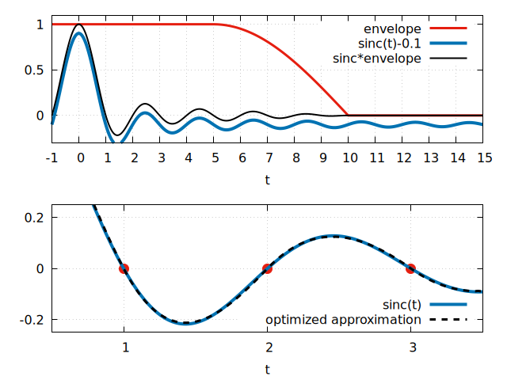

# Efficient and accurate implementation of sinc interpolation

## TLDR 

How to do an accurate `sinc(x) = sin(pi*x)/(pi*x)` interpolation efficiently with optimized 3rd order polynomial approximation. 

## Motivation

Whenever an analog signal `y(t)` is digitized into a sequence of values equidistant in time `(t_0,y_0), (t_1,y_1), ... (t_N,y_N)`, the signal shape between these points is in general not captured. 
But if the analog signal contains **only frequency components below half the sampling frequency**, the exact shape of the original signal can be reconstructed with the sinc interpolation:
```
y(t) = sum_i y_i * sinc(t-ti)  
```

The exact reconstruction requires an infinite amount of points prior and past the time of interest. 
Therefore sinc interpolation can only be approximated in practical applications. 
Also, the calculation of the true sinc-function is computationally expensive.

## Approximation with 3rd order polynomials

A fast way of implementing an approximated sinc interpolation is by using the first derivative of the `sinc(t)` for integer values of `t`. Then connect adjacent points by polynomials of 3rd order:
A sinc interpolation can be implemented very efficiently when taking only into accounts sinc-derivatives around a cutoff range of `N_cutoff` points.
Only N samples and N derivatives need to be buffered in order to calculate the polynomials.
The 3rd order polynomials make it easy to compute intersections with the curve and a constant.

However, this method has shortcomings:
  - Deviations are clearly visible outside the first polynomial sections around 0.
  - At the cutoff distance the curve will not be smooth 


## Improved implementation

### Higher order polynomials?

In order to improve the accuracy, it is possible to use in addition the second (or even higher order) derivative of the sinc function to improve the accuracy. 
However, this complicates the calculation of intersections with the approximated curve and the implementation will have to store more data to perform the approximation. Also the non-smoothness at the cutoff distance is not solved.

### Optimized 3rd order polynomial approximation

It is possible to modify the derivatives of the polynomials at the sampling points such that they do not exactly match the first derivative of the sinc function, but approximate the sinc function best over the entire section between two sampling points. 

The program `sinc_approx.d` calculates optimized polynomial coefficients by performing a least-squares of the approximated sinc function using all polynomial coefficients as fit parameters.
The cutoff is implemented by applying an envelope function that provides a smooth transition from the sinc function to flat zero between `N_cutoff/2` and `N_cutoff` by a cos-function.

The following picture shows sinc multiplied with the envelope function, which is used to perform the fit of the polynomial coefficients.


Compared to the approximation with the first derivatives of `sinc`, the optimized polynomials approximate the sinc function much better while preserving all the benefits of the method.

